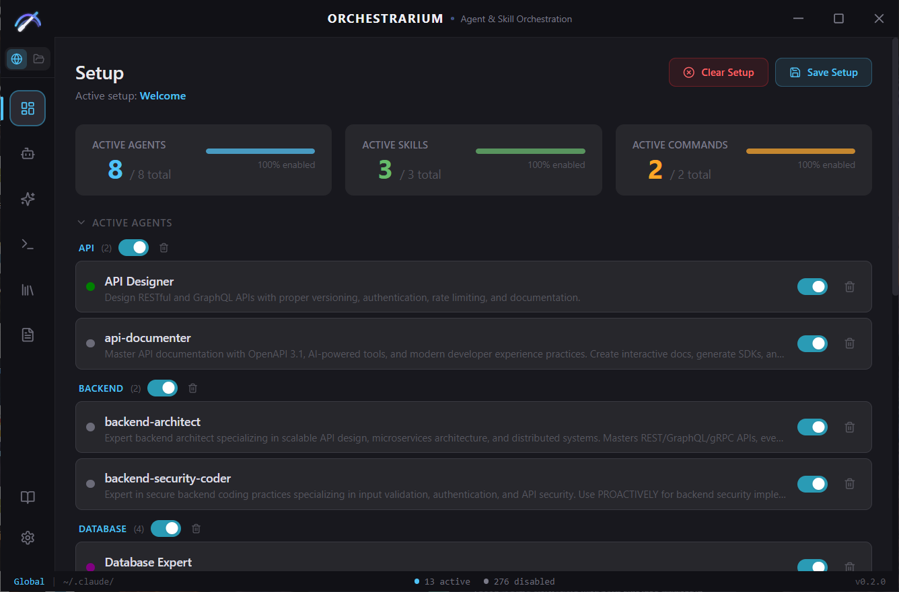
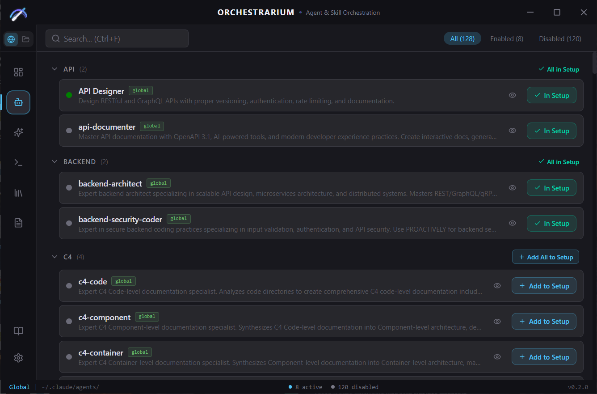
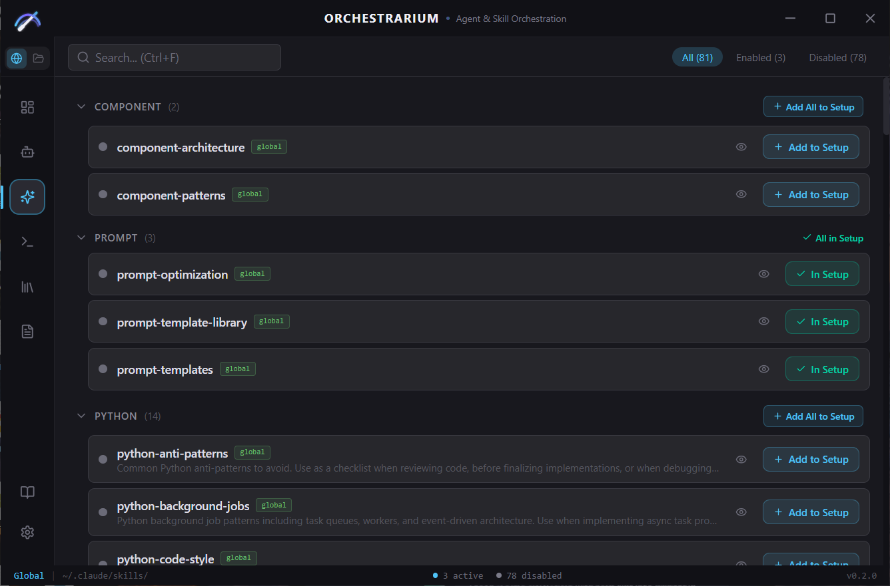
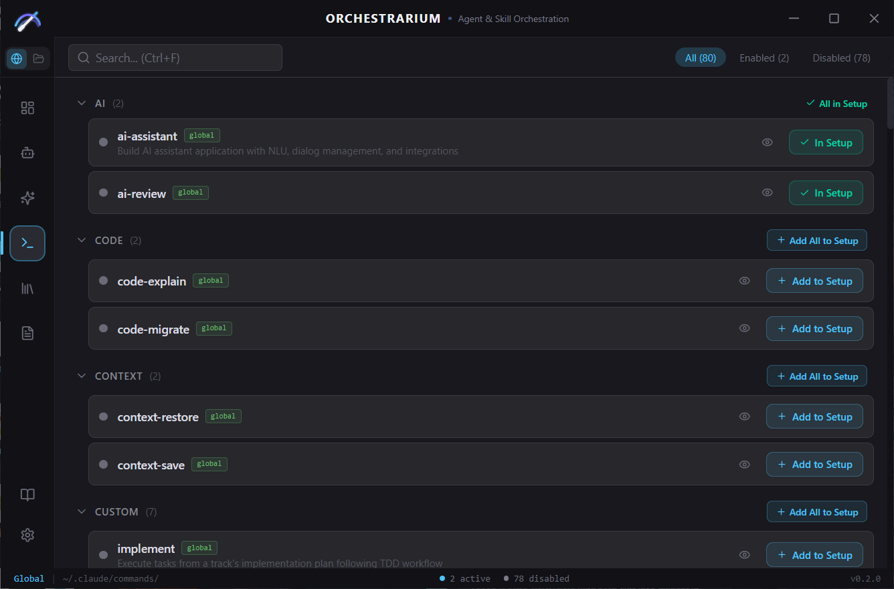
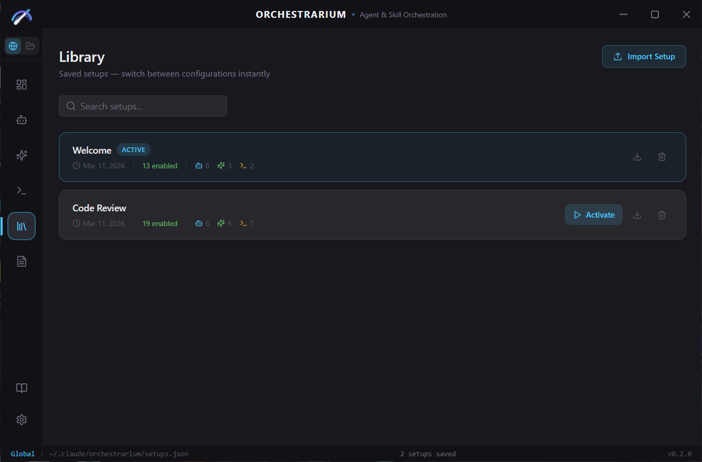
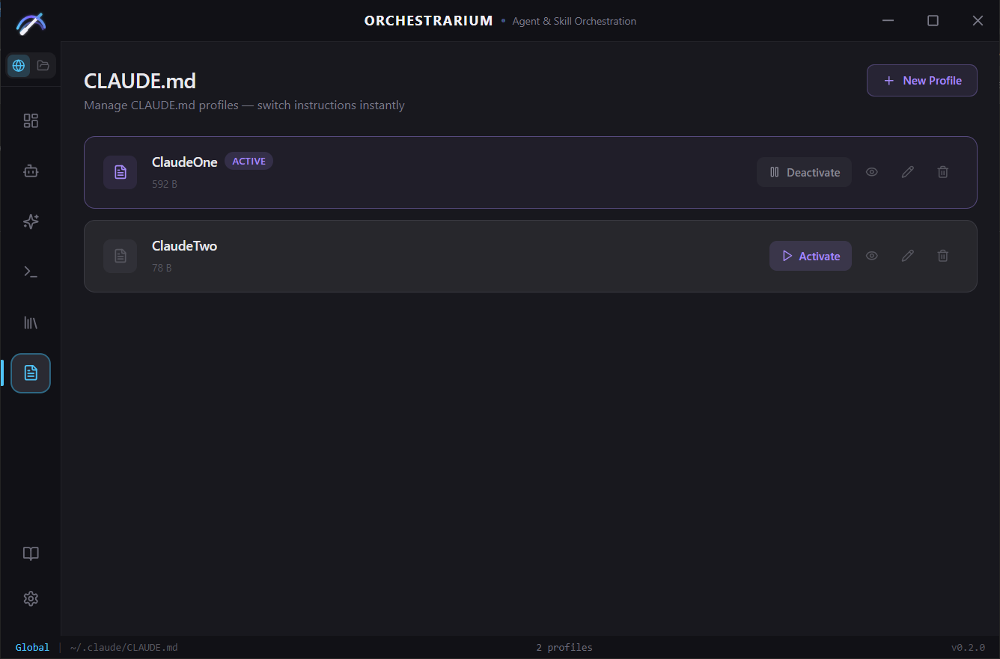
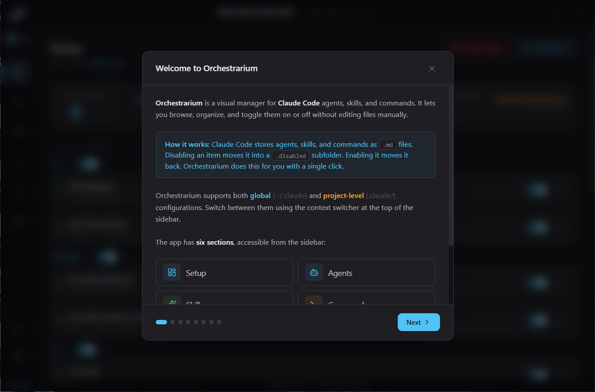
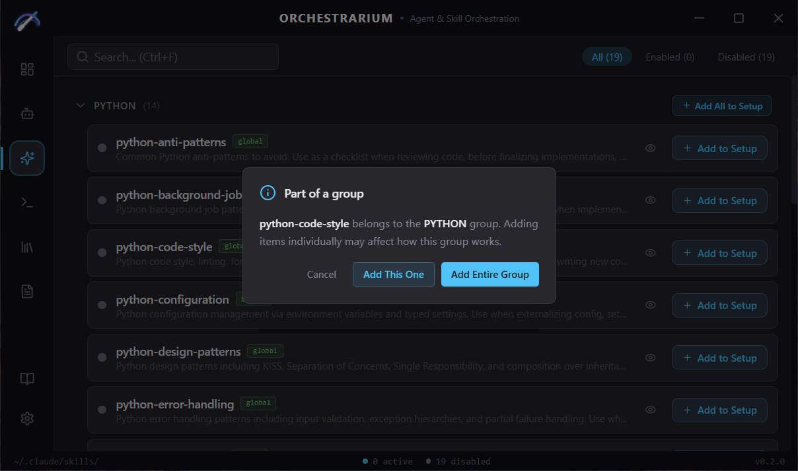
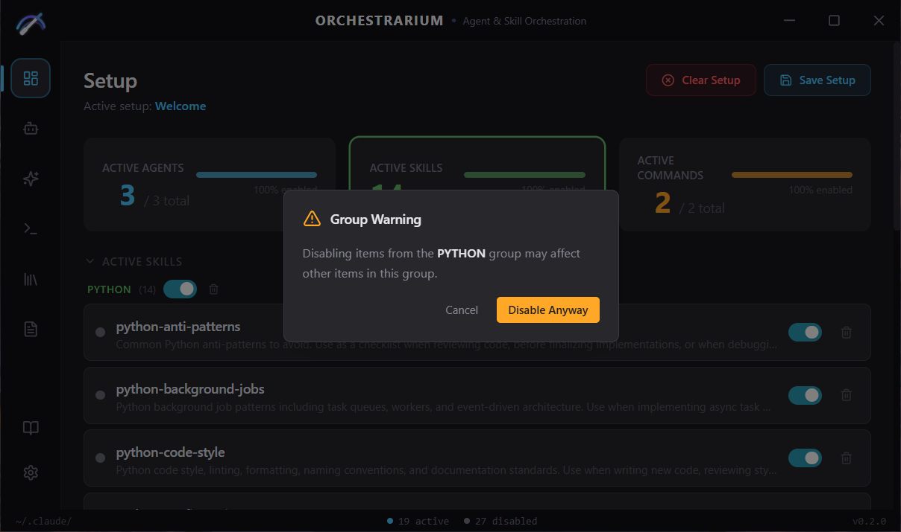
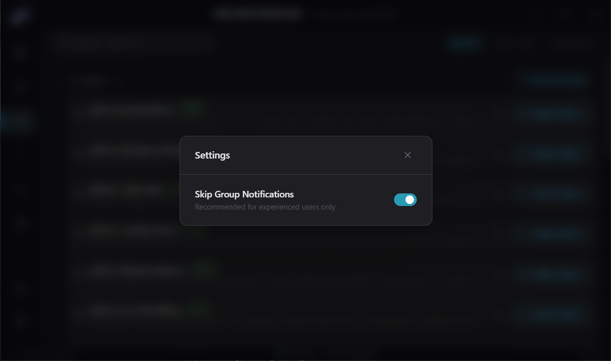

# Orchestrarium

**Agent & Skill Orchestration for Claude Code**

A visual desktop app to browse, organize, and toggle Claude Code agents, skills, commands, and CLAUDE.md profiles — without editing files manually.

*Built entirely through conversation with [Claude Code](https://docs.anthropic.com/en/docs/claude-code), without writing a single line of code manually.*

---

## What is Orchestrarium?

Claude Code stores agents, skills, and commands as `.md` files in `~/.claude/`. Disabling an item means moving it into a `.disabled/` subfolder. Enabling it means moving it back.

Orchestrarium gives you a clean UI to do this with a single click — plus saved setups, CLAUDE.md profile switching, project-level management, and more.

---

## Table of Contents

- [Where do agents, skills, and commands come from?](#where-do-agents-skills-and-commands-come-from)
- [Features in detail](#features-in-detail)
  - [Setup](#setup)
  - [Agents / Skills / Commands](#agents--skills--commands)
  - [Library](#library)
  - [CLAUDE.md Profiles](#claudemd-profiles)
  - [Project Context](#project-context)
  - [Settings](#settings)
- [Screenshots](#screenshots)
- [Installation](#installation)
- [How it works](#how-it-works)
- [Tech Stack](#tech-stack)
- [The Story](#the-story)
- [Roadmap](#roadmap)

---

## Where do agents, skills, and commands come from?

Orchestrarium **does not install or create** agents, skills, or commands — it manages what's already on your system. These `.md` files are created by Claude Code itself or by community tools and extensions.

When you first use Claude Code, it automatically populates `~/.claude/` with built-in agents, skills, and slash commands. If you install community agents or create your own, they go into the same folders.

### What Orchestrarium scans

| Context | Agents | Skills | Commands |
|---------|--------|--------|----------|
| **Global** | `~/.claude/agents/*.md` | `~/.claude/skills/*.md` | `~/.claude/commands/*.md` |
| **Project** | `{project}/.claude/agents/*.md` | `{project}/.claude/skills/*.md` | `{project}/.claude/commands/*.md` |

Disabled items are stored in a `.disabled/` subfolder inside each directory (e.g. `~/.claude/agents/.disabled/`).

### What is NOT scanned

- **Subfolders** — only top-level `.md` files are detected. Nested directories like `commands/gsd/*.md` are not scanned yet (subfolder support is on the [roadmap](#roadmap)).
- **Non-`.md` files** — `.txt`, `.json`, and other formats are ignored.
- **Other directories** — only `agents/`, `skills/`, and `commands/` are scanned. Files in the root of `~/.claude/` (like `CLAUDE.md`) are managed separately through the [CLAUDE.md Profiles](#claudemd-profiles) section.

### If your folders are empty

If you just installed Claude Code and see nothing in Orchestrarium — that's normal. You need to run Claude Code at least once so it can create its configuration directories and populate them with built-in items. You can also manually place `.md` files into the folders listed above, and Orchestrarium will pick them up instantly thanks to the built-in file watcher.

---

## Features in detail

### Setup

The Setup page is your control center — it shows all items you've added and lets you manage them.

- **Summary cards** at the top display active counts for Agents, Skills, and Commands. Click a card to filter the list by that category; click again to show all.
- **Toggle switches** enable or disable items. This moves the `.md` file on disk in real time — Claude Code picks up changes instantly, no restart needed.
- **Group toggles** let you enable/disable all items in a group at once. Groups are collapsible.
- **Remove button** (trash icon) removes an item from your Setup and disables it if it was on. You can also remove entire groups.
- **Save Setup** — saves a snapshot of your current configuration (which items are in the setup and their on/off state) to the Library. Give it a name to find it later.
- **Update button** — appears when you modify an active setup (toggle items, add or remove). Click it to save the changes back to that setup in the Library.
- **Clear Setup** — removes all items at once and disables everything on disk. Your saved setups in the Library are not affected.
- **Active setup indicator** — when you activate a setup from the Library, its name appears under the header so you always know which configuration is loaded.
- **Group warnings** — when you disable an item that belongs to a named group with multiple items, a warning appears. You can dismiss it or turn off warnings entirely in Settings.
- **First launch** — Orchestrarium automatically detects all agents, skills, and commands that are already active on your system and adds them to Setup. You don't need to configure anything.

### Agents / Skills / Commands

These three sections share the same layout. Each one lists all items of that type found on your system.

- **Search bar** — filter items by name or description in real time.
- **Filter pills** — show All, Enabled, or Disabled items. Each pill shows a count.
- **Grouped layout** — items are organized by group name. Named groups appear first with a collapsible header; ungrouped items appear under "Custom".
- **Item cards** show:
  - Item name and description (parsed from the `.md` frontmatter)
  - **Scope badge** — `global` or `project`, so you always know where the file lives
  - **Preview button** (eye icon) — view the full `.md` file content in a read-only modal
  - **Add to Setup** button — includes this item in your Setup
  - **In Setup** badge — shown if the item is already in your Setup
- **Group-level actions** — "Add All to Setup" adds every item in a group at once. If all items are already added, an "All in Setup" badge is shown.
- **Group warning** — when adding a single item from a multi-item group, you're asked whether to add just that item or the entire group.

### Library

The Library stores all your saved setups. Switch between configurations instantly.

- **Save** — from the Setup page, click "Save Setup", give it a name, and it's stored in the Library.
- **Activate** — applies a saved setup. This is **exclusive**: it enables only items in that setup and **disables everything else**. The setup name then appears in the Setup page header.
- **Update** — if you modify an active setup (toggle, add, or remove items), an Update button appears on the Setup page to save changes back.
- **Export** — saves a setup as a `.json` file you can share with others or back up.
- **Import** — loads a setup from a `.json` file. If a setup with the same name already exists, you're prompted to replace it. If the imported setup was created in a different context (global vs project), a warning is shown.
- **Delete** — removes a setup from the Library with a confirmation step.
- **Search** — find setups by name.
- **Setup cards** show the name, creation date, number of enabled items, and a breakdown by type (agents/skills/commands).

Setups are stored in `~/.claude/orchestrarium/setups.json`.

### CLAUDE.md Profiles

`CLAUDE.md` is a configuration file that defines how Claude Code behaves — its rules, style, and instructions. Orchestrarium lets you manage multiple profiles and switch between them.

- **Auto-import** — if you already have a `~/.claude/CLAUDE.md` file, Orchestrarium automatically imports it as a "Default" profile on first launch.
- **New Profile** — create a profile from scratch (empty) or copy from your current CLAUDE.md.
- **Activate** — writes the profile content into `~/.claude/CLAUDE.md`. Claude Code reads it immediately.
- **Deactivate** — clears the CLAUDE.md file. The profile stays saved for later.
- **Preview** — view profile content in a read-only modal.
- **Edit** — built-in editor to modify profile content directly in the app. Tracks unsaved changes.
- **Delete** — removes a profile. If it was active, CLAUDE.md is also cleared.

Profiles are stored in `~/.claude/orchestrarium/claude-profiles/`.

### Project Context

Orchestrarium supports two contexts — **global** and **project-level**:

- **Global** (`~/.claude/`) — agents, skills, and commands available in every project.
- **Project** (`{project}/.claude/`) — items scoped to a specific project directory.

How to use project context:

1. **Open a project** — click the folder icon at the top of the sidebar and select your project directory. The context switches to "Project" automatically.
2. **Switch contexts** — use the globe/folder toggle at the top of the sidebar. Globe = global, Folder = project.
3. **Scope badges** — every item card shows whether it's `global` or `project`, so you always know where the file lives.
4. **Copy to project** — when in project context, global items can be copied into the project's `.claude/` directory and added to your project Setup.
5. **Change or clear project** — hover the project name in the sidebar to reveal a clear (X) button, or click the "Change Project" button at the bottom of the sidebar.

Each context has its own independent Setup and Library entries. Switching context instantly shows items from the corresponding directory.

### Settings

Settings are accessible via the gear icon at the bottom of the sidebar.

- **Skip Group Notifications** — disables warnings when toggling items that belong to a group. Recommended for experienced users only.

---

## Screenshots

<strong>Agents</strong> — browse and add to setup

<strong>Skills</strong> — grouped by prefix

<strong>Commands</strong> — slash commands overview

<strong>Library</strong> — saved setups

<strong>CLAUDE.md</strong> — profile manager

<strong>Tutorial</strong> — built-in guide

<strong>Group warnings</strong> — smart notifications

When adding a single item from a group:

When disabling an item from an active group:

<strong>Settings</strong>

---

## Installation

1. Download the latest installer for your platform from [Releases](../../releases):
   - **Windows:** `.exe` installer
   - **macOS:** `.dmg` (Apple Silicon & Intel)
   - **Linux:** `.deb` / `.AppImage`
2. Run the installer
3. Orchestrarium will auto-detect your `~/.claude/` directory

> **Note:** macOS builds are unsigned. On first launch: right-click the app → Open → Open.

---

## How it works

| Action | What happens on disk |
|--------|---------------------|
| Enable an item | `.disabled/file.md` moves to `file.md` |
| Disable an item | `file.md` moves to `.disabled/file.md` |
| Save Setup | Current on/off state saved to `~/.claude/orchestrarium/setups.json` |
| Activate Setup | Items in the setup are enabled, **everything else is disabled** |
| Activate CLAUDE.md profile | Profile content copied to `~/.claude/CLAUDE.md` |
| Deactivate profile | `~/.claude/CLAUDE.md` cleared |

---

## Tech Stack

- **Frontend:** React 19, TypeScript, Tailwind CSS 4, Zustand 5
- **Backend:** Tauri 2, Rust
- **Testing:** Vitest (46 tests), Cargo test (42 tests)

---

## The Story

I want to share how I came to create Orchestrarium. Watching developers chat in tech communities, I kept seeing the same questions: *"What's your setup?"*, *"Which agents do you use?"*, *"What tools do you have enabled?"* — and looking at the answers, I couldn't find a place to see all of this in a clean, visual UI.

I wanted to see my agents, skills, and commands laid out visually — what's enabled, what's disabled. Maybe it's just the aesthetic pleasure of seeing everything organized, but perhaps you, as developers and engineers, will find something more than just aesthetics in this app.

I want you to know: **I don't speak English natively and I don't know how to code.** I built this entirely by talking to Claude Code — setting tasks, structuring conversations, and iterating until I got what I wanted. I think I did a decent job considering my limitations.

Thank you for reading this far — for me, that's already a small victory and motivation to keep going.

---

## Roadmap

- ~~**Project-level scope**~~ ✅ — done in v0.2.0
- **Subfolder support** — scan and manage agents in nested directories (e.g. `commands/gsd/*.md`)
- **MCP server management** — configure and toggle MCP servers
- **Agent creator** — create new agents directly from the UI
- **Content preview** — view full agent/skill content inline in the card
- **Drag & drop import** — drag `.md` files into the app to install them

Have an idea? [Open an issue](../../issues) — feedback and contributions are welcome.

---

## License

MIT
